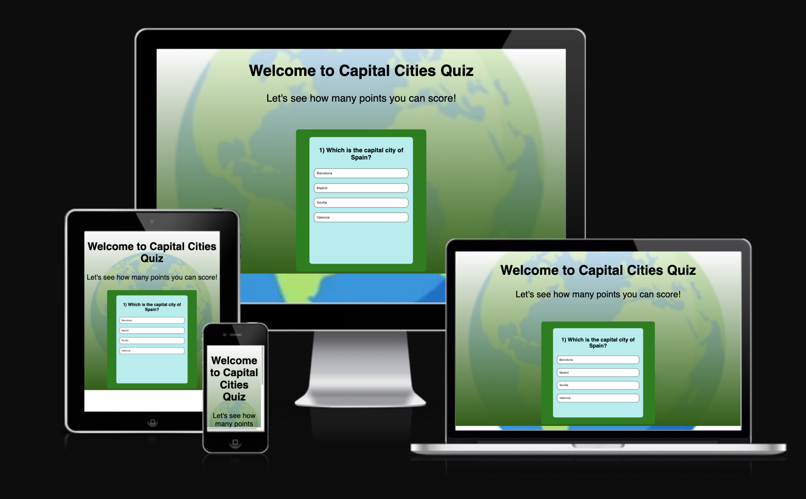
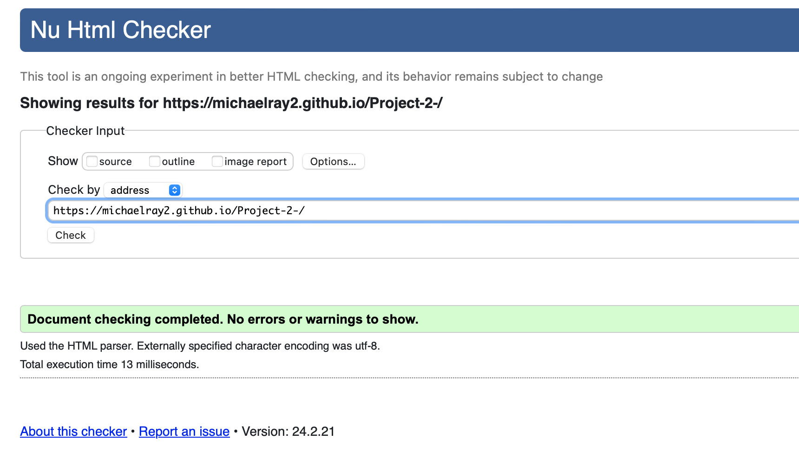
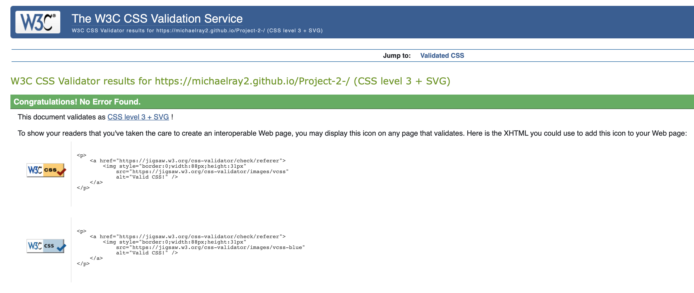
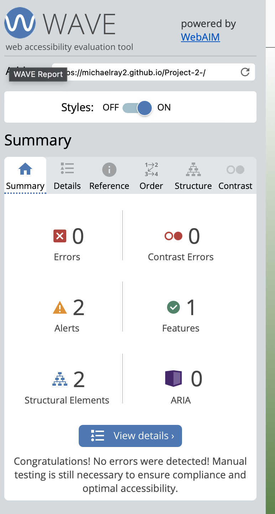
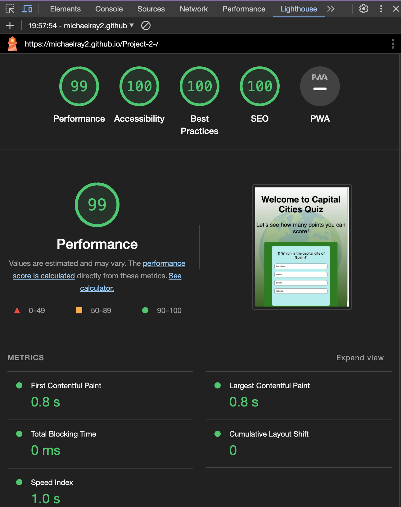
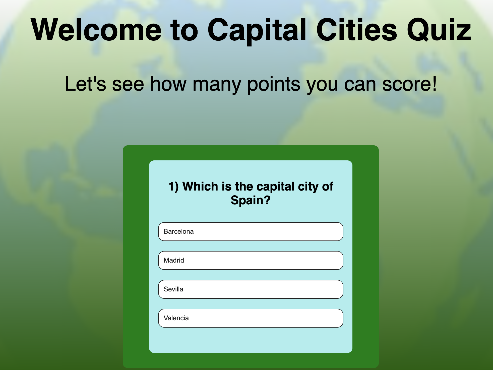
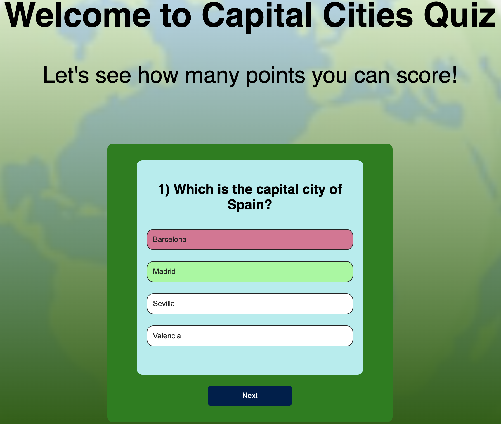
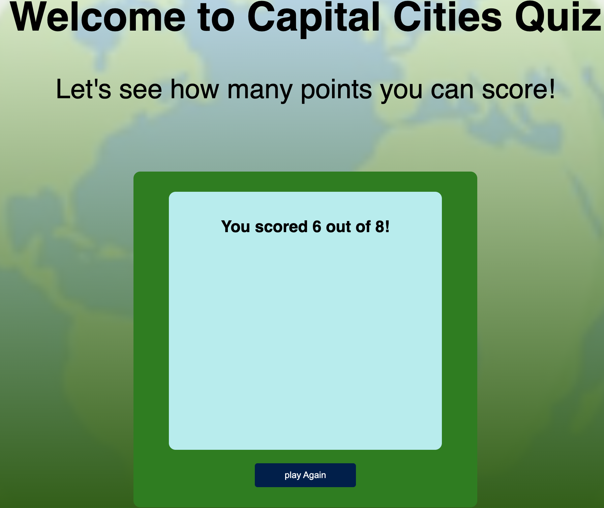

# Capital Cities Quiz
(Developer: Michael Ray)

## Table of Content

1. [Project Goals](#project-goals)
    1. [User Goals](#user-goals)
    2. [Site Owner Goals](#site-owner-goals)
2. [User Experience](#user-experience)
    1. [Target Audience](#target-audience)
    2. [User Requirements and Expectations](#user-requirements-and-expectations)
    3. [User Stories](#user-stories)
    4. [Site Owner Stories](#site-owner-stories)
3. [Design](#design)
    1. [Design Choices](#design-choices)
    2. [Colour](#colours)
    3. [Fonts](#fonts)
    4. [Structure](#structure)
4. [Technologies Used](#technologies-used)
    1. [Languages](#languages)
    2. [Frameworks & Tools](#frameworks-&-tools)
5. [Features](#features)
6. [Testing](#validation)
    1. [HTML Validation](#HTML-validation)
    2. [CSS Validation](#CSS-validation)
    3. [JavaScript Validation](#javascript-validation)
    4. [Accessibility](#accessibility)
    5. [Performance](#performance)
    6. [Device testing](#performing-tests-on-various-devices)
    7. [Browser compatibility](#browser-compatability)
    8. [Testing user stories](#testing-user-stories)
8. [Bugs](#Bugs)
9. [Deployment](#deployment)
10. [Credits](#credits)
11. [Acknowledgments](#acknowledgments)

## Project Goals
Create an interactive quiz around World Capital Cities where the user is presented with a score out of 8 at the end.

### User Goals
- Play a fun and engaging quiz and test the user's knowledge on capital cities.
- The game should be fully responsive and capable of being played on different devices.

## User Experience

### Target Audience
- Casual Quizers.
- People who want to test their knowledge of world capital cities.
- People who have a spare 2 minutes and want to play a game to pass the time.

### User Requirements and Expectations
- A simple and intuitive game to play
- Quick and easy to play.
- Functions that work as expected where correct answers are stored as correct.
- Nicely presented for the user with a relevent background image.

### User Stories
- As a user, I want to be able to begin to play the game.
- As a user, I want to be able to select an incorrect answer and the correct answer should be revealed.
- As a user, I want to be given a score once I have completed the game.

### Site Owner Stories
- I want to be able to send the quiz to friends and family so they can see how many points they can score.

## Design 

### Design Choices
The game was designed to have a calming and relaxing effect on the user.

### Colour
The colour scheme used on the page is predominatley green. This suits the background image which shows a green planet Earth.
The background colour transitions from white to green in a linear gradient. This helps the black text at the top to stand-out.

### Fonts 
I have decided to use the Open Sans font as this is my favourite.

### Structure
The page is structured in a user-friendly and intuitive way.

- A homepage with a brief introduction.
- A quiz area with a question and 4 different buttons to choose from.
- A 404 page.

## Technologies Used

### Languages
- HTML 
- CSS
- JavaScript

### Framework & Tools
- Visual Studio Code
- Git
- GitHub
- Font Awesome
- W3C Markup validation service
- W3C Jigsaw CSS validation service 
- Hint JS validator
- Google Lighthouse

## Features
- The site consists of one page with a game area where the user will interactive with.
- The user is presented with feedback in the form of s score once the last question has been answered.
- Once the user selects clicks on an answer button, it will appear green if correct and red if not correct.
- Once the user has selected an answer, a next button will appear that will allow the user to advance onto the next question.
- The user will be unable to click on another button once a single answer has been selected.

### 404 message
- Provides the user with a way to return to the game after clicking on a broken link.

## Validation

### HTML Validation

HTML

### CSS Validation

CSS

### JavaScript Validation

JS

### Accessibility
The WAVE WebAIM web accessibility evaluation tool was used to ensure the website met high accessibility standards. All pages pass with 0 errors.

Contrast

### Performance
Google Lighthouse in Google Chrome Developer Tools was used to test the performance of the website.

Google Lighthouse

### Performing tests on various devices
The website was tested on the following devices:

- LG 4K Ultrafine monitor
- 14' mac book pro
- Iphone 14
- Iphone 9

### Browser Compatability
The website was tested on the following browsers:

- Google Chrome
- Safari

### Testing User Stories

1. As a user, I want to be able to begin to play the game.

| **Feature** | **Action** | **Expected Result** | **Actual Result** |
|-------------|------------|---------------------|-------------------|
| Start screen | Click on the answer to the first question| The game's screen feedbacks to correct answer | Works as expected |

Screenshots

2. As a user, I want to be able to select an incorrect answer and the correct answer should be revealed.

| **Feature** | **Action** | **Expected Result** | **Actual Result** |
|-------------|------------|---------------------|-------------------|
| Start screen | Click on an incorrect answer| The correct answer is highlighted in pale green| Works as expected |

Screenshots

3. As a user, I want to be given a score once I have completed the game.

| **Feature** | **Action** | **Expected Result** | **Actual Result** |
|-------------|------------|---------------------|-------------------|
| Start screen | Answer the final question| The user is given a score out of 8| Works as expected |

Screenshots

## Deployment
The site was deployed using GitHub Pages by following these steps:
1. In the GitHub repository navigate to the Settings tab along the top of the page.
2. On the left hand menu click on Pages
3. For the source select Branch: master
4. After the webpage refreshes automaticaly you will se a ribbon on the top saying: "Your site is live at https://michaelray2.github.io/Project-2-/"

## Bugs
1. When used on iphone, the answer that the user pick remains the black colour rather than changing to the colour that depends on whether the answer selected was correct. With more time this would be an issue I would like to research on how to fix.
2. When the application would open on mobile devices, the heading text was too large. I implemented a media query in order to fix this issue.
3. The user was able to select multiple answers in the quiz which was ruining the user experience. I learned how to implement the JS function that would prevent the user from being able to pick multiple answers.
4. During development, the next button would be available before an answer had been clicked meaning the user could andvance through the quiz without answering the questions. I fixed this by learning how to implement the necesarry css (display: none) along with while loops to solve this issue.

## Credits
The background image was taken from Shutterstock. Credit: Jane Kelly.

### Code
The code used to support me with this project were as follows:
1. JavaScript Techniques from the Love Maths Walkthrough project facilitated by the Code Institute.
2. JavaScriot Techniques as well as button design inspiration from taken from a YouTube video published by GreatStack https://www.youtube.com/watch?v=PBcqGxrr9g8.

## Acknowledgments
I would like to thank my mentor Mo Shami for his feedback and guidance.